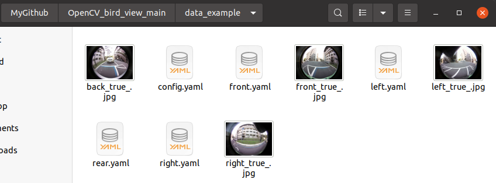

This Repository for calibration birds view using OpenCV. the progress under developing. will update soon

### How to install
#### Clone Repository
1. Use this command to clone the repository
    ```
    git clone https://github.com/aji-ptn/Calibration_Bird_View_OpenCV.git
    ```

2. Create virtual environment
   - Open your terminal in clone directory
   ```
   cd Calibration_Bird_View_OpenCV
   ```
   - Create env using python 3.8 or 3.6
   ```
   python3.6 -m venv venv
   source venv/bin/activate
   ```
   - Install requirements
   ```
   pip install -r requirements.txt 
   ```
   
3. Run the program
   ```
   cd src/main/python/
   python3 main.py
   ```


### Data Example
Open data example to image example in image save



