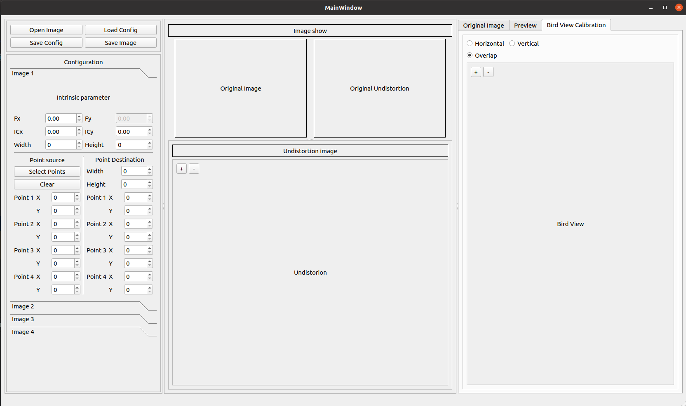

This Repository for calibration birds view using OpenCV. 

### How to install
Please open this link to run this repository https://docs.google.com/presentation/d/16HHIuObvZk0xcehCHzu2CNyuOE28cB8leS9UgbG0m60/edit?usp=sharing
#### Clone Repository
1. Use this command to clone the repository
    ```
    git clone https://github.com/aji-ptn/Calibration_Bird_View_OpenCV.git
    ```

2. Create virtual environment
   - Open your terminal in clone directory
   ```
   cd Calibration_Bird_View_OpenCV
   ```
   - Create env using python 3.8 or python 3.9
   ```
   python3.8 -m venv venv
   source venv/bin/activate
   ```
   - Install requirements
   ```
   pip install --upgrade pip
   pip install -r requirements.txt 
   ```
   
3. Run the program
   ```
   cd src/main/python/
   python3 main.py
   ```


### Data Example
Open data example to image example in image save

#### 1. Image sources


#### 2. Image result

